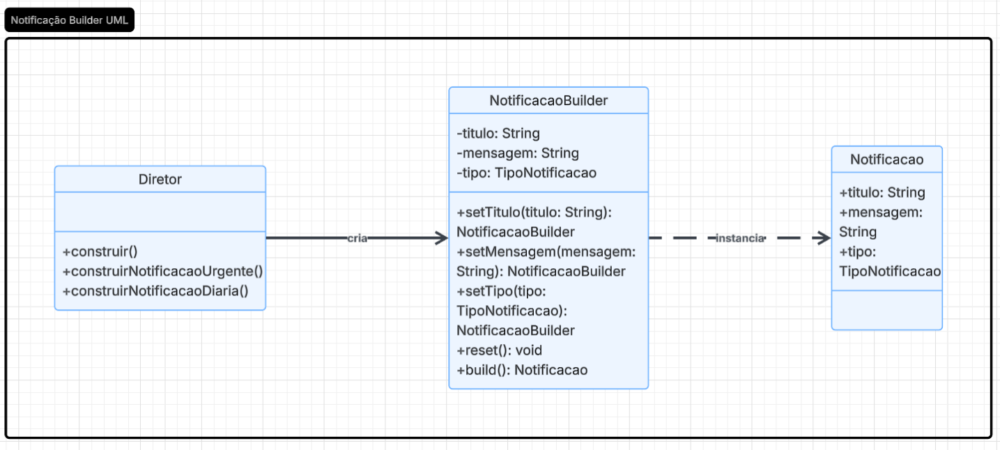
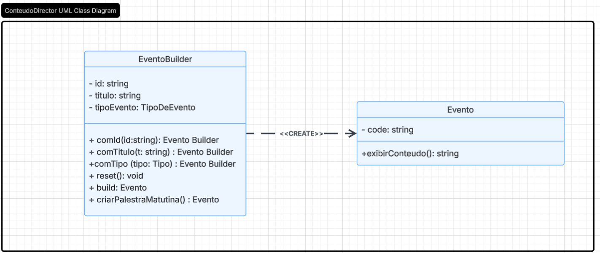

# 3.1.1 Builder

## 1. Visão Geral

O **Builder** é um padrão de projeto **criacional**, catalogado pela **Gang of Four (GoF)**, que permite construir objetos complexos passo a passo, separando o processo de construção da representação final do objeto **([GAMMA et al., 1995](https://www.javier8a.com/itc/bd1/articulo.pdf))**.

Em vez de um construtor com dezenas de parâmetros opcionais — o chamado *telescoping constructor* —, o Builder encapsula cada etapa da montagem em métodos distintos. Isso torna o código de criação mais legível, seguro e flexível, além de permitir que o mesmo processo de construção produza diferentes representações do objeto ([REFACTORING.GURU, 2026](https://refactoring.guru/design-patterns/builder)).

<p align="center"><strong>Figura 1: Representação do Builder</strong></p>



<p align="center"><em>Fonte: elaborado pelos autores</em></p>

## 2. Participantes

| Aluno  | Participação|
| -- | -- |
| [Felipe Lopes Pedroza](https://github.com/darkymeubem) | Criação do Diagrama, do Código e da Documentação |
| [Felipe Matheus Ribeiro Lopes](https://github.com/femathrl0) | Criação do Diagrama, do Código e da Documentação |
| [Felipe Guimaraes Fernandes](https://github.com/felipegf1) | Criação do Diagrama, do Código e da Documentação |

## 3. Aplicabilidade

O padrão **Builder** pode ser utilizado em várias situações, sendo algumas das mais comuns ([REFACTORING.GURU, 2026](https://refactoring.guru/design-patterns/builder)):

### 3.1. Quando a criação de um objeto exige muitos parâmetros opcionais

O Builder evita o problema do *telescoping constructor* (construtores com N argumentos opcionais), expondo cada parâmetro em um método próprio. O cliente monta apenas o que precisa, ignorando o restante com segurança.

### 3.2. Quando o mesmo processo de construção deve gerar representações diferentes

Como o processo de construção fica desacoplado do produto final, é possível reutilizar o mesmo Builder para criar variações do objeto — por exemplo, um `EventoBuilder` que gera tanto palestras matutinas quanto workshops à tarde, a partir de métodos de conveniência internos.

### 3.3. Quando a ordem e a validade dos passos de construção importam

O método `.build()` concentra as **regras de negócio e validações**, garantindo que um objeto só seja instanciado quando todos os campos obrigatórios foram fornecidos corretamente — algo difícil de controlar com construtores diretos.

## 4. Prós

- Permite construir objetos complexos **passo a passo**, com total controle sobre cada atributo.
- Elimina construtores sobrecarregados com muitos parâmetros opcionais.
- Centraliza as **validações** no método `.build()`, garantindo integridade do produto.
- A **Fluent Interface** (encadeamento de métodos) torna o código de construção expressivo e legível.
- Segue o **Princípio da Responsabilidade Única**, separando a lógica de construção da lógica do produto.
- Métodos de atalho internos (ex.: `criarPalestraMatutina()`) simulam o papel do *Director* sem a necessidade de uma classe extra.

## 5. Contras

- Pode aumentar a quantidade de classes no sistema, especialmente quando há muitos produtos distintos.
- Para objetos simples, o Builder adiciona complexidade desnecessária — um construtor direto já é suficiente.
- O estado interno do Builder entre chamadas pode causar comportamentos inesperados se o `reset()` não for chamado ou compreendido.

## 6. Implementação

### 6.1 Senso Crítico

No contexto do **FCTE Hoje**, a aplicação do padrão GoF Builder mostrou-se adequada para lidar com a criação do `Evento`, que é o tipo de conteúdo mais rico do sistema, possuindo atributos altamente opcionais como `data`, `local`, `horários` e `agenda`. Forçar todos esses campos em um construtor único seria burocrático e propenso a erros.

Neste diagrama, o **EventoBuilder** gerencia seus atributos internos com prefixo `_` (convenção pythônica), expõe **métodos fluídos** que retornam `self` permitindo o encadeamento de chamadas, e implementa o método de atalho `criarPalestraMatutina()` para simular o papel do *Director* — eliminando a necessidade de uma classe separada. O método `.build()` concentra as validações de negócio antes de instanciar e retornar o produto final `Evento`.

A decisão de **eliminar a interface do Builder e a classe Director isolada** mantém coerência com o restante do sistema (padrão Factory já implementado), reduzindo a burocracia sem perder os benefícios do padrão. O próprio Builder concreto assume todas as responsabilidades, tornando o código mais enxuto e idiomático em Python.

A construção do padrão ocorreu de forma colaborativa durante a aula de **Dinâmica de Elaboração**, com momentos de discussão conjunta, revisão do diagrama e apresentação do material à professora, visando verificar se estava corretamente representado.

### 6.2 Diagrama do projeto

O diagrama abaixo representa a estrutura do padrão Builder aplicada ao módulo de **criação de Eventos**.



<p align="center"><em>Autor: <a href="https://github.com/darkymeubem">Felipe Lopes Pedroza</a>, <a href="https://github.com/femathrl0">Felipe Matheus Ribeiro Lopes</a> e <a href="https://github.com/felipegf1">Felipe Guimaraes Fernandes</a></em></p>

### 6.3 Código

#### 6.3.1 Enum de Tipos

```python
from enum import Enum

class TipoDeEvento(Enum):
    PALESTRA = "Palestra"
    WORKSHOP = "Workshop"
    DEBATE = "Debate"
    ATIVIDADE_ESPORTIVA = "Atividade Esportiva"
```

#### 6.3.2 Produto (Evento)

```python
class Evento:
    def __init__(
        self,
        code: str,
        titulo: str,
        tipo: TipoDeEvento,
        data: str = None,
        local: str = None,
        horario_inicio: str = None,
        horario_fim: str = None,
        agenda: list = None,
    ):
        self._code = code
        self._titulo = titulo
        self._tipo = tipo
        self._data = data
        self._local = local
        self._horario_inicio = horario_inicio
        self._horario_fim = horario_fim
        self._agenda = agenda or []

    def exibirConteudo(self) -> str:
        info = f"[{self._tipo.value}] {self._titulo} (Código: {self._code})"
        if self._data:
            info += f" | Data: {self._data}"
        if self._local:
            info += f" | Local: {self._local}"
        if self._horario_inicio and self._horario_fim:
            info += f" | Horário: {self._horario_inicio} - {self._horario_fim}"
        if self._agenda:
            info += f" | Agenda: {', '.join(self._agenda)}"
        return info
```

#### 6.3.3 Builder Concreto (EventoBuilder)

```python
class EventoBuilder:
    def __init__(self):
        self.reset()

    def reset(self) -> "EventoBuilder":
        self._id = None
        self._titulo = None
        self._tipoEvento = None
        self._data = None
        self._local = None
        self._horario_inicio = None
        self._horario_fim = None
        self._agenda = []
        return self

    def comId(self, id: str) -> "EventoBuilder":
        self._id = id
        return self

    def comTitulo(self, titulo: str) -> "EventoBuilder":
        self._titulo = titulo
        return self

    def comTipo(self, tipo: TipoDeEvento) -> "EventoBuilder":
        self._tipoEvento = tipo
        return self

    def comData(self, data: str) -> "EventoBuilder":
        self._data = data
        return self

    def comLocal(self, local: str) -> "EventoBuilder":
        self._local = local
        return self

    def comHorario(self, inicio: str, fim: str) -> "EventoBuilder":
        self._horario_inicio = inicio
        self._horario_fim = fim
        return self

    def comAgenda(self, itens: list) -> "EventoBuilder":
        self._agenda = itens
        return self

    def build(self) -> Evento:
        if not self._id:
            raise ValueError("O ID do evento é obrigatório.")
        if not self._titulo:
            raise ValueError("O título do evento é obrigatório.")
        if not self._tipoEvento:
            raise ValueError("O tipo do evento é obrigatório.")

        evento = Evento(
            code=self._id,
            titulo=self._titulo,
            tipo=self._tipoEvento,
            data=self._data,
            local=self._local,
            horario_inicio=self._horario_inicio,
            horario_fim=self._horario_fim,
            agenda=self._agenda,
        )
        self.reset()
        return evento
```

#### 6.3.4 Método de Conveniência (papel do Director)

```python
    def criarPalestraMatutina(self) -> Evento:
        return (
            self.comId("EVT-PAL-MAT")
            .comTitulo("Palestra Matutina FCTE")
            .comTipo(TipoDeEvento.PALESTRA)
            .comData("2026-05-20")
            .comLocal("Auditório FCTE")
            .comHorario("08:00", "10:00")
            .comAgenda(["Abertura", "Apresentação", "Q&A"])
            .build()
        )
```

#### 6.3.5 Exemplo de Uso

```python
builder = EventoBuilder()

# Construção customizada com Fluent Interface
evento_customizado = (
    builder
    .comId("EVT-WS-001")
    .comTitulo("Workshop de Arquitetura de Software")
    .comTipo(TipoDeEvento.WORKSHOP)
    .comData("2026-06-10")
    .comLocal("Sala 302 - FCTE")
    .comHorario("14:00", "17:00")
    .comAgenda(["Padrões Criacionais", "Padrões Estruturais", "Padrões Comportamentais"])
    .build()
)

# Atalho de conveniência (Director embutido)
palestra = builder.criarPalestraMatutina()

# Objeto simples com apenas campos obrigatórios
evento_simples = (
    builder
    .comId("EVT-DEB-002")
    .comTitulo("Debate sobre Educação")
    .comTipo(TipoDeEvento.DEBATE)
    .build()
)
```

**Saída esperada:**

```
Evento customizado:
  [Workshop] Workshop de Arquitetura de Software (Código: EVT-WS-001) | Data: 2026-06-10 | Local: Sala 302 - FCTE | Horário: 14:00 - 17:00 | Agenda: Padrões Criacionais, Padrões Estruturais, Padrões Comportamentais

Palestra matutina (atalho de conveniência):
  [Palestra] Palestra Matutina FCTE (Código: EVT-PAL-MAT) | Data: 2026-05-20 | Local: Auditório FCTE | Horário: 08:00 - 10:00 | Agenda: Abertura, Apresentação, Q&A

Evento simples (apenas campos obrigatórios):
  [Debate] Debate sobre Educação (Código: EVT-DEB-002)
```

## 7. Referências Bibliográficas

> GAMMA, E.; HELM, R.; JOHNSON, R.; VLISSIDES, J. **Design Patterns: Elements of Reusable Object-Oriented Software**. Reading, MA: Addison-Wesley, 1995. Disponível em: [https://www.javier8a.com/itc/bd1/articulo.pdf](https://www.javier8a.com/itc/bd1/articulo.pdf). Acesso em: 20 mai. 2026.
>
> REFACTORING.GURU. **Builder — Design Patterns**. 2026. Disponível em: [https://refactoring.guru/design-patterns/builder](https://refactoring.guru/design-patterns/builder). Acesso em: 20 mai. 2026.

## 8. Histórico de Versões


| Versão | Data | Descrição | Autor(es) | Revisor(es) | Data da revisão | Detalhes da Revisão |
|--------|------|-----------|-----------|-------------|-----------------|---------------------|
| `1.0` | 12/05/2026 | Criação do documento. | [Tiago Lemes](https://github.com/TiagoTeixeira-2005) |  |  | |
| `1.1` | 20/05/2026 | Preenchimento da Visão Geral, Aplicabilidade, Prós, Contras, Implementação (Senso Crítico, Diagrama, Código) e Referências. | [Felipe Lopes Pedroza](https://github.com/darkymeubem), [Felipe Matheus Ribeiro Lopes](https://github.com/femathrl0) e [Felipe Guimaraes Fernandes](https://github.com/felipegf1) | | | |
