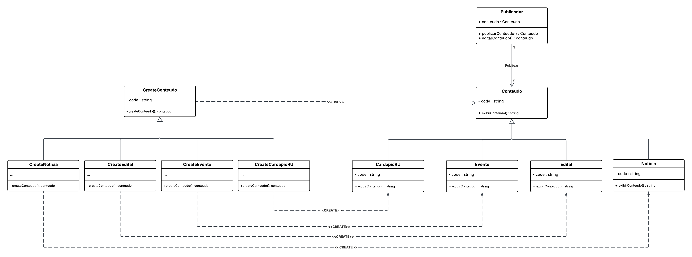

# 3.1.2 Factory

## 1. Visão Geral

O **Factory Method** é um padrão de projeto **criacional**, catalogado pela **Gang of Four (GoF)**, que define uma interface para criação de objetos, permitindo que subclasses decidam qual classe concreta instanciar **([GAMMA et al., 1995](https://www.javier8a.com/itc/bd1/articulo.pdf))**.

Em vez de o código usar diretamente o operador `new`, ele chama um método de fábrica, que centraliza a criação dos objetos.
Isso reduz o acoplamento do sistema, facilita a inclusão de novos tipos de objetos e evita códigos cheios de condicionais para decidir qual classe criar ([REFACTORING.GURU, 2026](https://refactoring.guru/design-patterns/factory-method)).

<p align="center"><strong>Figura 1: Representação do Factory Method</strong></p>


<p align="center"><em>Fonte: <a href="https://refactoring.guru/design-patterns/factory-method">Refactoring Guru - Factory Method</a></em></p>
</em></p>

## 2. Participantes

| Aluno  | Participação|
| -- | -- |
|  Arthur Guilherme Aquino Santos | Criação do Diagrama |
|  Tiago Lemes Teixeira | Criação da Documentação e do Diagrama |
|  Vilmar José Fagundes | Criação do Diagrama, criação do código e continuação da Documentação |

## 3. Aplicabilidade

O padrão **Factory Method** pode ser utilizado em várias situações, sendo algumas das mais comuns ([REFACTORING.GURU, 2026](https://refactoring.guru/design-patterns/factory-method)):

### 3.1. Quando os tipos concretos dos objetos ainda não são conhecidos

O Factory Method separa o **código que cria os objetos** do **código que os utiliza**, permitindo estender a criação sem modificar o restante do sistema.

### 3.2. Quando uma biblioteca ou framework deve permitir extensões

A herança permite estender funcionalidades, mas o sistema precisa saber **quando usar a subclasse em vez da classe padrão**. O Factory Method resolve isso, pois a criação de componentes fica concentrada em um único método sobrescrevível, permitindo modificar o comportamento do framework **sem alterar seu código-fonte**.

### 3.3. Quando é necessário reutilizar objetos custosos de criar

O Factory Method é indicado quando se deseja **economizar recursos** reutilizando objetos grandes ou pesados, como:

- conexões de banco de dados  
- recursos de rede  
- manipuladores de arquivos  
- objetos complexos ou caros de instanciar

Um **método regular**, como o empregado no Factory Method, pode tanto criar novos objetos quanto reutilizar instâncias existentes.

## 4. Prós

- Permite extensibilidade sem alterar código existente.
- Reduz acoplamento entre criadores e produtos concretos.
- Segue o **Princípio da Responsabilidade Única**, centralizando a lógica de criação em um único ponto do sistema, o que facilita manutenção.
- Segue o **Princípio Aberto/Fechado**, permitindo introduzir novos tipos de produtos sem modificar o código cliente existente.

## 5. Contras

- Pode aumentar a quantidade de subclasses necessárias para implementar o padrão.
- Pode introduzir complexidade adicional, especialmente se o sistema ainda é pequeno ou simples.
- Exige conhecimento de herança e interfaces, o que pode dificultar a compreensão para iniciantes.

## 6. Implementação

### 6.1 Senso crítico 

No contexto do **FCTE Hoje**, a aplicação do padrão GoF Factory mostrou adequada para desenvolver o sistema de criação do conteúdo do publicador. O objetivo central de poder criar notícias seguindo o Princípio da Responsabilidade Única, além da fácil manutenção e adição de novos conteúdos sem comprometer o código fonte se mostrou eficáz para o contexto dessa funcionalidade.

Neste diagrama, o **Produto Abstrato** `Conteudo` define a interface dos objetos a serem gerados, as implementações específicas ocorrem por meio dos **Produtos Concretos** `CardapioRU`, `Evento`, `Edital` e `Noticia`. o **Criador Abstrato** `CreateConteudo` declara o método `createConteudo()` para o retorno desses objetos, os **Criadores Concretos** `CreateCardapioRU`, `CreateEvento`, `CreateEdital` e `CreateNoticia` sobrescrevem a função para instanciar as respectivas classes e o **Cliente** `Publicador` utilizar as classes e mantem uma relação de 1:N com os conteúdos criados.

A construção do padrão ocorreu de forma colaborativa durante a aula de **Dinâmica de Elaboração**, com momentos de discussão conjunta, revisão do diagrama e apresentação do material à professora, visando verificar se estava corretamente representado.

### 6.2 Diagrama do projeto
O diagrama abaixo representa a estrutura do padrão Factory Method aplicada ao módulo de **criar conteúdo**.



<p align="center"><em>Autor: <a href="https://github.com/ArthurGuilher62">Arthur Guilherme</a>, <a href="https://github.com/TiagoTeixeira-2005">Tiago Lemes</a> e <a href="https://github.com/VilmarFagundes">Vilmar Fagundes</a></em></p>
</em></p>

### 6.3 Código

#### 6.3.1 Produto Abstrato

```python
    class Conteudo(ABC):
        def __init__(self, code: str):
            self._code = code
        
        @abstractmethod
        def exibirConteudo(self) -> str:
            pass
```

#### 6.3.2 Produto Concreto 

```python
    class CardapioRU(Conteudo):
        def exibirConteudo(self) -> str:
            return f"Exibindo o cardápio (Código: {self._code})"

    class Evento(Conteudo):
        def exibirConteudo(self) -> str:
            return f"Exibindo os detalhes do evento (Código: {self._code})"

    class Edital(Conteudo):
        def exibirConteudo(self) -> str:
            return f"Exibindo o edital (Código: {self._code})"

    class Noticia(Conteudo):
        def exibirConteudo(self) -> str:
            return f"Exibindo a notícia (Código: {self._code})"
```

#### 6.3.3 Criador Abstrato

```python
    class CreateConteudo(ABC):
        def __init__(self, code: str):
            self._code = code

        @abstractmethod
        def createConteudo(self) -> Conteudo:
            """Método Factory que cria e retorna um objeto Conteudo."""
            pass
```

#### 6.3.4 Criador Concreto

```python
    class CreateCardapioRU(CreateConteudo):
        def createConteudo(self) -> Conteudo:
            return CardapioRU(self._code)

    class CreateEvento(CreateConteudo):
        def createConteudo(self) -> Conteudo:
            return Evento(self._code)

    class CreateEdital(CreateConteudo):
        def createConteudo(self) -> Conteudo:
            return Edital(self._code)

    class CreateNoticia(CreateConteudo):
        def createConteudo(self) -> Conteudo:
            return Noticia(self._code)
```


## 7. Referências Bibliográficas

> GAMMA, E.; HELM, R.; JOHNSON, R.; VLISSIDES, J. **Design Patterns: Elements of Reusable Object-Oriented Software**. Reading, MA: Addison-Wesley, 1995. Disponível em: [https://www.javier8a.com/itc/bd1/articulo.pdf](https://www.javier8a.com/itc/bd1/articulo.pdf). Acesso em: 15 mai. 2026.
>
>REFACTORING.GURU. **Factory Method — Design Patterns**. 2026. Disponível em: [https://refactoring.guru/design-patterns/factory-method](https://refactoring.guru/design-patterns/factory-method). Acesso em: 15 mai. 2026.

## 8. Histórico de Versões


| Versão | Data | Descrição | Autor(es) | Revisor(es) | Data da revisão |
|--------|------|-----------|-----------|-------------|-----------------|
| `1.0` | 12/05/2026 | Criação do documento. | [Tiago Lemes](https://github.com/TiagoTeixeira-2005) | [Vilmar Fagundes](https://github.com/VilmarFagundes) | 19/05/2026 |
| `1.1` | 15/05/2026 | Documentação da Visão Geral, Aplicabilidade, Prós e Contras. | [Tiago Lemes](https://github.com/TiagoTeixeira-2005) | [Vilmar Fagundes](https://github.com/VilmarFagundes) | 19/05/2026 |
| `1.2` | 19/05/2026 | Adição dos tópicos 6 | [Vilmar Fagundes](https://github.com/VilmarFagundes) | [Tiago Lemes](https://github.com/TiagoTeixeira-2005) | 19/05/2026 |
