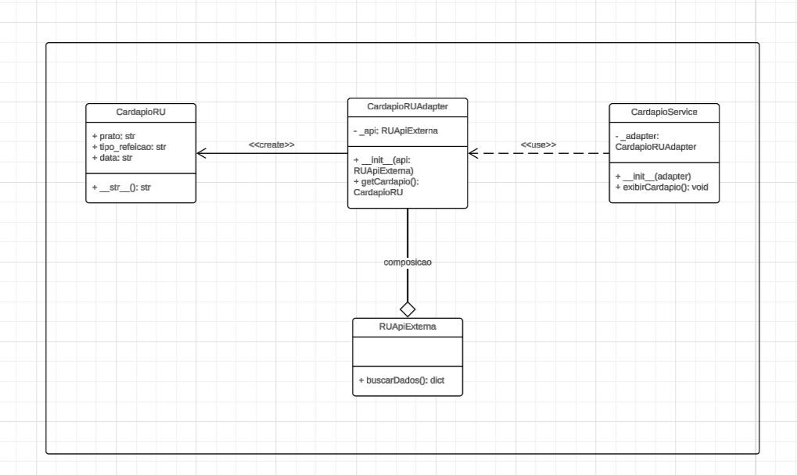

# 3.2.1 Adapter

## 1. Visão Geral
O Adapter é um padrão de projeto estrutural que permite objetos com interfaces incompatíveis colaborarem entre si.
## 2. Participantes

| Aluno  | Participação|
| -- | -- |
|[Arthur Gomes ](https://github.com/arthurgomes1290) | Criação do Diagrama, do Código e da Documentação|
|[Pedro Miguel](https://github.com/pedromadbr) | Criação do Diagrama, do Código e da Documentação|
|[Felipe Guimarães](https://github.com/felipegf1) | Criação do Diagrama, do Código e da Documentação|

## 3. Aplicabilidade
1. O Tradutor (O uso mais comum)

Quando usar: Você tem uma classe que funciona muito bem (pode ser um código antigo do seu sistema ou uma biblioteca de terceiros), mas os métodos dela têm nomes ou formatos diferentes do que o resto do seu sistema espera.

- De forma simples: Em vez de sair quebrando e reescrevendo o seu código ou mexendo em uma biblioteca que você nem tem acesso, você cria o Adapter. Ele fica no meio do caminho, recebe a chamada do seu jeito e traduz para o jeito que a classe antiga entende.

2. O "Agrupador" de Funcionalidades (O cenário das subclasses)

Essa segunda parte do texto aborda um problema de herança. Imagine que você tem 5 subclasses diferentes (por exemplo, Carro, Moto, Caminhao, etc.) e descobre que precisa dar a todas elas uma funcionalidade nova (como enviar_localizacao_via_gps()).

Se você não puder mexer na superclasse (a classe mãe de todas), você teria duas saídas ruins:

- Criar 5 novas classes filhas (ex: CarroComGPS, MotoComGPS...) e duplicar o código do GPS em todas elas.

- Colocar o código de GPS direto nas classes existentes, gerando bagunça.

## 4. Prós
- Princípio de responsabilidade única. Você pode separar a conversão de interface ou de dados da lógica primária do negócio do programa.
- Princípio aberto/fechado. Você pode introduzir novos tipos de adaptadores no programa sem quebrar o código cliente existente, desde que eles trabalhem com os adaptadores através da interface cliente.
## 5. Contras
-  A complexidade geral do código aumenta porque você precisa introduzir um conjunto de novas interfaces e classes. Algumas vezes é mais simples mudar a classe serviço para que ela se adeque com o resto do seu código.

## 6. Implementação
Nesta seção, é apresentada a aplicação prática do padrão de projeto Adapter no ecossistema do sistema de informações do campus. O objetivo principal é integrar uma API externa que fornece os dados do cardápio do Restaurante Universitário (RU) — cujo formato de chaves e dados é incompatível — ao nosso modelo de dados padrão interno (CardapioRU), sem que o cliente (CardapioService) precise conhecer os detalhes da requisição externa.

### 6.1. Senso Crítico
A escolha pelo padrão Adapter para a integração do cardápio do RU justifica-se pelos seguintes fatores técnicos e de arquitetura:

- Isolamento de Código de Terceiros: A API do RU (RUApiExterna) utiliza um padrão de nomenclatura específico (como dt_referencia e nome_prato) e valores em letras minúsculas (almoco). Se integrássemos essa API diretamente nas nossas regras de negócio, qualquer mudança futura no contrato desse fornecedor quebraria o sistema inteiro. O adaptador encapsula essa volatilidade.

- Adesão aos Princípios SOLID:

    - Princípio da Responsabilidade Única (SRP): A classe CardapioRUAdapter possui apenas uma razão para mudar: a forma como os dados externos são mapeados para o nosso formato interno.

    - Princípio do Aberto/Fechado (OCP): Se amanhã o campus mudar de fornecedor de API ou decidir puxar os dados de um arquivo XML/JSON local, basta criar um novo adaptador. O código do cliente (CardapioService) permanecerá intacto.

- Legibilidade e Padronização: O adaptador não apenas altera a estrutura do dicionário, mas também limpa os dados (como aplicar o .capitalize() em "almoco" para virar "Almoco"), garantindo que o restante da aplicação receba dados prontos e higienizados.

## 6.2 Diagrama



## 6.3 Código

### 6.3.1 Classe de Dados Interna (CardapioRU)

```python
class CardapioRU:
    def __init__(self, prato: str, tipo_refeicao: str, data: str):
        self.prato = prato
        self.tipo_refeicao = tipo_refeicao
        self.data = data

    def __str__(self):
        return f"[{self.tipo_refeicao}] {self.prato} | Data: {self.data}"
```

### 6.3.2 Adapter — API Externa com Formato Incompatível

```python
class RUApiExterna:
    def buscarDados(self) -> dict:
        return {
            "nome_prato": "Frango grelhado ao limao",
            "turno": "almoco",
            "dt_referencia": "20/05/2026"
        }
```

### 6.3.3 Adapter — Converte o Formato Externo para o Formato Interno

```python
class CardapioRUAdapter:
    def __init__(self, api: RUApiExterna):
        self._api = api

    def getCardapio(self) -> CardapioRU:
        dados = self._api.buscarDados()
        return CardapioRU(
            prato=dados["nome_prato"],
            tipo_refeicao=dados["turno"].capitalize(),
            data=dados["dt_referencia"]
        )
```

### 6.3.4 Cliente — Usa o Adapter sem Conhecer a API Externa

```python
class CardapioService:
    def __init__(self, adapter):
        self._adapter = adapter

    def exibirCardapio(self) -> None:
        cardapio = self._adapter.getCardapio()
        print(f"[CardapioService] Cardapio carregado: {cardapio}")
```

### 6.3.5 Exemplo de Uso

```python
api_externa = RUApiExterna()
adapter = CardapioRUAdapter(api_externa)
service = CardapioService(adapter)

service.exibirCardapio()
```

### Saída Esperada

```
[CardapioService] Cardapio carregado: [Almoco] Frango grelhado ao limao | Data: 20/05/2026
```


## 7. Referências Bibliográficas

> REFACTORING.GURU. **Decorator — Design Patterns**. 2026. Disponível em: [https://refactoring.guru/design-patterns/adapter](https://refactoring.guru/design-patterns/adapter).

## 8. Histórico de Versões


| Versão | Data | Descrição | Autor(es) | Revisor(es) | Data da revisão | Detalhes da Revisão |
|--------|------|-----------|-----------|-------------|-----------------|---------------------|
| `1.0` | 12/05/2026 | Criação do documento. | [Tiago Lemes](https://github.com/TiagoTeixeira-2005) |  |  | |
| `1.1` | 20/05/2026 | Alteração do documento. | [Arthur Gomes](https://github.com/arthurgomes1290) |