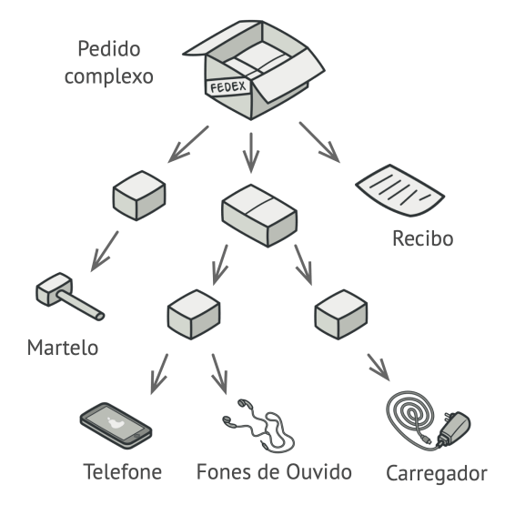
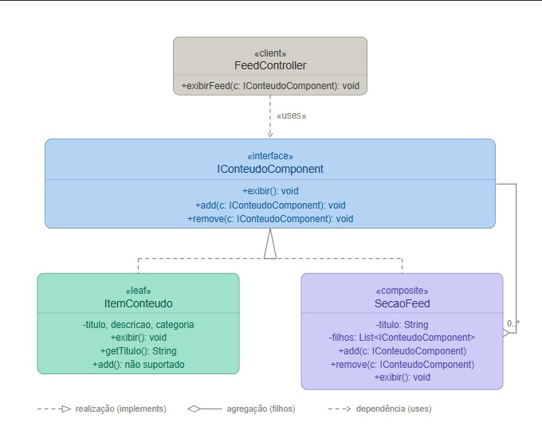

# 3.2.2 Composite

## 1. Visão Geral

O **Composite** é um padrão de projeto **estrutural**, catalogado pela **Gang of Four (GoF)**, que permite compor objetos em estruturas de árvore para representar hierarquias de parte-todo. O padrão permite que os clientes tratem objetos individuais e composições de objetos de forma uniforme **([GAMMA et al., 1995](https://www.javier8a.com/itc/bd1/articulo.pdf))**.

O Composite resolve o problema de estruturar componentes hierárquicos, onde uma árvore pode conter tanto folhas (elementos simples) quanto galhos (containers que podem conter outras árvores). Ao implementar uma interface comum, tanto as folhas quanto os containers respeitam o mesmo contrato, eliminando a necessidade de verificações de tipo no código cliente ([REFACTORING.GURU, 2026](https://refactoring.guru/pt-br/design-patterns/composite)).

<p align="center"><strong>Figura 1: Representação do Composite (Refactoring Guru)</strong></p>



<p align="center"><em>Imagem de referência extraída do site <a href="https://refactoring.guru/pt-br/design-patterns/composite">Refactoring Guru — Composite</a></em></p>

<p align="center"><strong>Figura 2: Representação do Composite (Elaboração da Equipe)</strong></p>



<p align="center"><em>Fonte: elaborado pelos autores</em></p>

## 2. Participantes

| Aluno  | Participação|
| -- | -- |
| [Felipe Pedroza](https://github.com/darkymeubem) | Elaboração do **diagrama** e da **documentação** |
| [Felipe Matheus](https://github.com/femathrl0) | Elaboração do **diagrama** |

## 3. Aplicabilidade

O padrão **Composite** pode ser utilizado em várias situações, sendo algumas das mais comuns ([REFACTORING.GURU, 2026](https://refactoring.guru/pt-br/design-patterns/composite)):

### 3.1. Quando precisa representar hierarquias de objetos parte-todo

O Composite permite que você trabalhe com árvores de objetos como se fossem objetos únicos. Uma pasta contém arquivos e outras pastas; uma empresa contém departamentos e subdepartamentos.

### 3.2. Quando quer que o código cliente trate da mesma forma objetos simples e compostos

Graças à interface comum, o cliente não precisa saber se está lidando com uma folha ou um container — ambos respondem aos mesmos métodos.

### 3.3. Quando deseja criar estruturas complexas sem verificações repetidas de tipo

Em vez de usar `isinstance()` ou `type()` para decidir como tratar um objeto, você confia na polimorfismo: a interface garante que toda classe sabe como se comportar.

## 4. Prós

- Simplifica o **código cliente** ao tratar árvores de objetos como se fossem objetos únicos.
- Facilita a adição de novos tipos de componentes (folhas ou containers) sem alterar o código existente (**Princípio Aberto/Fechado**).
- Permite construir **estruturas hierárquicas complexas** de forma recursiva e natural.
- Reduz a complexidade ao eliminar verificações de tipo repetidas no código cliente.

## 5. Contras

- Pode tornar o design mais genérico do que o necessário, especialmente se apenas alguns tipos de operações fazem sentido em certos componentes.
- Implementações ingênuas podem levar a erros em tempo de execução se subclasses não implementarem corretamente operações que não fazem sentido para elas.
- Em linguagens sem verificação de tipo rigorosa, é possível chamar métodos inadequados (ex.: `add()` em uma folha), resultando em comportamentos inesperados.

## 6. Implementação

### 6.1. Senso Crítico

No contexto do **FCTE Hoje**, o padrão Composite foi aplicado ao **feed de conteúdo** para permitir organizar itens em seções hierárquicas. Um `ItemConteudo` representa um item individual (notícia, evento, cardápio), enquanto uma `SecaoFeed` é um container que pode conter tanto items quanto outras seções.

O `FeedController` atua como client, operando sobre a estrutura através da interface `IConteudoComponent`. Independentemente de estar adicionando um item simples ou uma seção inteira, o cliente chama `add()` e `exibir()` sem distinguir o tipo — o padrão garante que ambos respondam corretamente.

Essa abordagem oferece flexibilidade para estruturar o feed de forma hierárquica (ex.: "Notícias > Tecnologia > Machine Learning"), enquanto mantém a simplicidade de uma interface uniforme. O padrão complementa o **Observer** ([3.3.2](3.3.2.Observer.md)) na notificação de mudanças, e trabalha em conjunto com o **Factory** ([3.1.2](../3.1.2.Factory.md)) na criação dos componentes.

### 6.2. Diagrama do projeto

<p align="center"><strong>Figura 3: Estrutura do Composite FCTE Hoje</strong></p>

O diagrama acima (Figura 2) representa a aplicação do padrão no módulo de **organização hierárquica do feed de conteúdo**.

### 6.3. Código

#### 6.3.1 Interface Componente (IConteudoComponent)

```python
from abc import ABC, abstractmethod


class IConteudoComponent(ABC):
    @abstractmethod
    def exibir(self) -> None:
        pass

    @abstractmethod
    def add(self, component: "IConteudoComponent") -> None:
        pass

    @abstractmethod
    def remove(self, component: "IConteudoComponent") -> None:
        pass
```

#### 6.3.2 Leaf (ItemConteudo)

```python
class ItemConteudo(IConteudoComponent):
    def __init__(self, titulo: str, descricao: str, categoria: str):
        self.titulo = titulo
        self.descricao = descricao
        self.categoria = categoria

    def exibir(self) -> None:
        print(f"[ItemConteudo] {self.titulo} — {self.descricao} ({self.categoria})")

    def getTitulo(self) -> str:
        return self.titulo

    def add(self, component: IConteudoComponent) -> None:
        print("[ItemConteudo] Operação add() não é suportada em folhas.")

    def remove(self, component: IConteudoComponent) -> None:
        print("[ItemConteudo] Operação remove() não é suportada em folhas.")
```

#### 6.3.3 Composite (SecaoFeed)

```python
class SecaoFeed(IConteudoComponent):
    def __init__(self, titulo: str):
        self.titulo = titulo
        self.filhos: list[IConteudoComponent] = []

    def getTitulo(self) -> str:
        return self.titulo

    def add(self, component: IConteudoComponent) -> None:
        self.filhos.append(component)
        titulo_componente = component.getTitulo() if hasattr(component, 'getTitulo') else "Seção"
        print(f"[SecaoFeed] '{titulo_componente}' adicionado.")

    def remove(self, component: IConteudoComponent) -> None:
        if component in self.filhos:
            self.filhos.remove(component)
            print(f"[SecaoFeed] Componente removido.")
        else:
            print("[SecaoFeed] Componente não encontrado.")

    def exibir(self) -> None:
        print(f"\n=== Seção: {self.titulo} ===")
        for filho in self.filhos:
            filho.exibir()
```

#### 6.3.4 Client (FeedController)

```python
class FeedController:
    def __init__(self):
        self.raiz = SecaoFeed("Feed Principal")

    def exibirFeed(self) -> None:
        self.raiz.exibir()

    def adicionarConteudo(self, component: IConteudoComponent) -> None:
        self.raiz.add(component)

    def removerConteudo(self, component: IConteudoComponent) -> None:
        self.raiz.remove(component)
```

#### 6.3.5 Exemplo de Uso

```python
# Instancia o controller
controller = FeedController()

# Cria items
noticia_ia = ItemConteudo(
    "Avanços em IA",
    "Novos modelos de linguagem",
    "Tecnologia"
)
noticia_web = ItemConteudo(
    "Web 3.0",
    "O futuro da internet descentralizada",
    "Tecnologia"
)
evento_workshop = ItemConteudo(
    "Workshop de Python",
    "Aprenda Python do zero",
    "Evento"
)

# Cria seções
secao_tecnologia = SecaoFeed("Tecnologia")
secao_eventos = SecaoFeed("Eventos")

# Adiciona items às seções
secao_tecnologia.add(noticia_ia)
secao_tecnologia.add(noticia_web)
secao_eventos.add(evento_workshop)

# Adiciona seções ao feed principal
controller.adicionarConteudo(secao_tecnologia)
controller.adicionarConteudo(secao_eventos)

# Exibe a hierarquia completa
controller.exibirFeed()
```

#### 6.3.6 Saída Esperada

```
[SecaoFeed] 'Avancos em IA' adicionado.
[SecaoFeed] 'Web 3.0' adicionado.
[SecaoFeed] 'Workshop de Python' adicionado.
[SecaoFeed] 'Tecnologia' adicionado.
[SecaoFeed] 'Eventos' adicionado.

[Exibindo hierarquia completa do feed]

=== Seção: Feed Principal ===

=== Seção: Tecnologia ===
[ItemConteudo] Avancos em IA — Novos modelos de linguagem (Tecnologia)
[ItemConteudo] Web 3.0 — O futuro da internet descentralizada (Tecnologia)

=== Seção: Eventos ===
[ItemConteudo] Workshop de Python — Aprenda Python do zero (Evento)
```

## 7. Referências Bibliográficas

> GAMMA, E.; HELM, R.; JOHNSON, R.; VLISSIDES, J. **Design Patterns: Elements of Reusable Object-Oriented Software**. Reading, MA: Addison-Wesley, 1995. Disponível em: [https://www.javier8a.com/itc/bd1/articulo.pdf](https://www.javier8a.com/itc/bd1/articulo.pdf). Acesso em: 21 mai. 2026.
>
> REFACTORING.GURU. **Composite — Padrões de Projeto**. 2026. Disponível em: [https://refactoring.guru/pt-br/design-patterns/composite](https://refactoring.guru/pt-br/design-patterns/composite). Acesso em: 21 mai. 2026.

## 8. Histórico de Versões

| Versão | Data | Descrição | Autor(es) | Revisor(es) | Data da revisão | Detalhes da Revisão |
|--------|------|-----------|-----------|-------------|-----------------|---------------------|
| `1.0` | 12/05/2026 | Criação do documento. | [Tiago Lemes](https://github.com/TiagoTeixeira-2005) |  |  | |
| `1.1` | 21/05/2026 | Adição do conteúdo do documento, implementação Python, diagramas e imagens de referência. | [Felipe Pedroza](https://github.com/darkymeubem), [Felipe Matheus](https://github.com/femathrl0) |  |  | |
