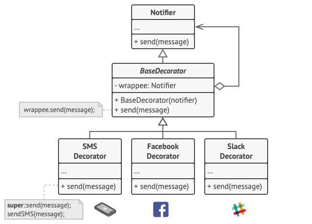
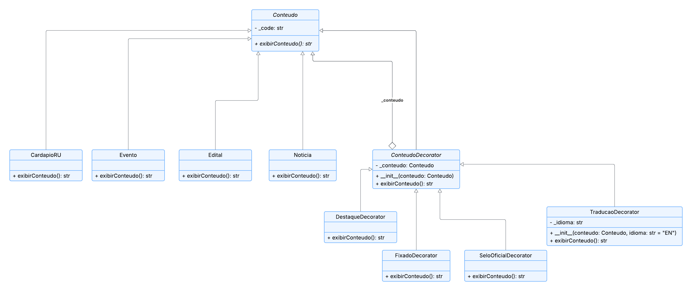

# 3.2.3 Decorator

## 1. Visão Geral

O **Decorator** é um padrão de projeto **estrutural**, catalogado pela **Gang of Four (GoF)**, que permite anexar novas responsabilidades a um objeto de forma dinâmica, oferecendo uma alternativa flexível à criação de subclasses para estender funcionalidades ([GAMMA et al., 1995](https://www.javier8a.com/itc/bd1/articulo.pdf)).

A ideia central é envolver o objeto original dentro de um outro objeto — o decorador — que implementa a **mesma interface** do componente decorado e adiciona comportamento **antes ou depois** de delegar a chamada ao objeto interno. Como cada decorador também é um componente, eles podem ser **empilhados em runtime**, combinando responsabilidades sem alterar a classe base e sem provocar explosão de subclasses ([REFACTORING.GURU, 2026](https://refactoring.guru/design-patterns/decorator)).

Essa abordagem favorece o **Princípio Aberto/Fechado** (aberto para extensão, fechado para modificação) e o **Princípio da Responsabilidade Única**, distribuindo funcionalidades opcionais em classes pequenas e coesas.

<p align="center"><strong>Figura 1: Representação do Decorator</strong></p>



<p align="center"><em>Fonte: <a href="https://refactoring.guru/design-patterns/decorator">Refactoring Guru - Decorator</a></em></p>

## 2. Participantes

| Aluno  | Participação|
| -- | -- |
| [Kauã Vale Leão](https://github.com/KauaVL) | Criação da Documentação e do Código |
| [Arthur Henrique Vieira](https://github.com/arthurhvieira1) | Criação da Documentação e do Diagrama |

## 3. Aplicabilidade

O padrão **Decorator** pode ser utilizado em diversas situações, sendo as mais comuns ([REFACTORING.GURU, 2026](https://refactoring.guru/design-patterns/decorator)):

### 3.1. Quando é preciso atribuir comportamentos extras a objetos em tempo de execução, sem afetar o restante do sistema

O Decorator permite organizar a lógica de negócio em **camadas independentes**, criando um decorador para cada nova responsabilidade e envolvendo o objeto-alvo com a combinação de camadas desejada — tudo isso sem modificar o código já existente e sem que o cliente perceba a diferença, já que tanto o componente quanto o decorador compartilham a mesma interface.

### 3.2. Quando estender por herança se torna impraticável

Em alguns cenários, o número de combinações possíveis de funcionalidades cresce rapidamente, o que tornaria a árvore de herança muito grande e difícil de manter (problema da **explosão de subclasses**). O Decorator resolve esse problema ao **combinar comportamentos por composição**, em vez de criar uma subclasse para cada variação.

### 3.3. Quando funcionalidades precisam ser ativadas/desativadas ou combinadas dinamicamente

Como cada decorador é independente e envolve apenas o objeto que recebe, é possível **adicionar ou trocar comportamentos em tempo de execução** — algo que herança, definida em tempo de compilação, não consegue oferecer.

## 4. Prós

- Estende o comportamento de um objeto **sem criar novas subclasses**.
- Permite **adicionar ou remover responsabilidades em tempo de execução**.
- Possibilita **combinar múltiplos comportamentos** envolvendo o objeto com vários decoradores.
- Segue o **Princípio da Responsabilidade Única**, separando uma classe monolítica em classes menores e mais coesas.
- Segue o **Princípio Aberto/Fechado**, permitindo introduzir novas variações sem modificar o código cliente.

## 5. Contras

- Pode ser **difícil remover um decorador específico** que esteja no meio da pilha de envoltórios.
- O comportamento final pode depender da **ordem** em que os decoradores são aplicados, o que exige cuidado na configuração.
- O **código de inicialização** pode parecer poluído, com muitas chamadas aninhadas para construir um objeto completamente decorado.
- Aumenta o número de pequenas classes no projeto, podendo dificultar a leitura para quem não conhece o padrão.

## 6. Implementação

### 6.1 Senso crítico

No contexto do **FCTE Hoje**, a aplicação do padrão GoF Decorator mostrou-se adequada para enriquecer dinamicamente os conteúdos publicados pelo sistema — notícias, eventos, editais e cardápios do RU — com marcações editoriais opcionais, como **Destaque**, **Fixado no topo**, **Selo Oficial FCTE** e **Tradução disponível**. Em vez de criar uma subclasse de `Conteudo` para cada combinação possível dessas marcações (o que levaria à explosão de subclasses), os decoradores permitem que essas responsabilidades sejam **acopladas em tempo de execução**, conforme a necessidade editorial do publicador.

Neste diagrama, o **Componente** abstrato `Conteudo` define a interface comum (`exibirConteudo`), reutilizando a hierarquia já estabelecida pelo padrão Factory. Os **Componentes Concretos** `Noticia`, `Evento`, `Edital` e `CardapioRU` representam os conteúdos básicos que podem ser decorados. O **Decorator** abstrato `ConteudoDecorator` herda de `Conteudo` e mantém uma referência para outro `Conteudo`, delegando a chamada ao objeto interno. Os **Decoradores Concretos** `DestaqueDecorator`, `FixadoDecorator`, `SeloOficialDecorator` e `TraducaoDecorator` sobrescrevem `exibirConteudo` para acrescentar comportamento antes ou depois da delegação, podendo ser **empilhados** em qualquer ordem.

Como o cliente `Publicador` (Factory) já trata todo conteúdo polimorficamente pela interface `Conteudo`, os decoradores convivem naturalmente com o restante do sistema, **sem exigir modificações** no código existente — reforçando o Princípio Aberto/Fechado.

A construção do padrão ocorreu de forma colaborativa durante a aula de **Dinâmica de Elaboração**, com discussão conjunta, revisão do diagrama e apresentação do material à professora, visando verificar se estava corretamente representado.

### 6.2 Diagrama do projeto

O diagrama abaixo representa a estrutura do padrão Decorator aplicada ao módulo de **enriquecimento de conteúdo**.



<p align="center"><em>Autor: <a href="https://github.com/KauaVL">Kauã Vale Leão</a> e <a href="https://github.com/arthurhvieira1">Arthur Henrique Vieira</a></em></p>

### 6.3 Código

#### 6.3.1 Componente (Component)

```python
    class Conteudo(ABC):
        def __init__(self, code: str):
            self._code = code

        @abstractmethod
        def exibirConteudo(self) -> str:
            pass
```

#### 6.3.2 Componentes Concretos (ConcreteComponent)

```python
    class CardapioRU(Conteudo):
        def exibirConteudo(self) -> str:
            return f"Exibindo o cardápio (Código: {self._code})"

    class Evento(Conteudo):
        def exibirConteudo(self) -> str:
            return f"Exibindo os detalhes do evento (Código: {self._code})"

    class Edital(Conteudo):
        def exibirConteudo(self) -> str:
            return f"Exibindo o edital (Código: {self._code})"

    class Noticia(Conteudo):
        def exibirConteudo(self) -> str:
            return f"Exibindo a notícia (Código: {self._code})"
```

#### 6.3.3 Decorator Base

```python
    class ConteudoDecorator(Conteudo):
        def __init__(self, conteudo: Conteudo):
            super().__init__(conteudo._code)
            self._conteudo = conteudo

        def exibirConteudo(self) -> str:
            return self._conteudo.exibirConteudo()
```

#### 6.3.4 Decoradores Concretos (ConcreteDecorator)

```python
    class DestaqueDecorator(ConteudoDecorator):
        def exibirConteudo(self) -> str:
            return f"[DESTAQUE] {self._conteudo.exibirConteudo()}"

    class FixadoDecorator(ConteudoDecorator):
        def exibirConteudo(self) -> str:
            return f"[FIXADO NO TOPO] {self._conteudo.exibirConteudo()}"

    class SeloOficialDecorator(ConteudoDecorator):
        def exibirConteudo(self) -> str:
            return f"[✓ OFICIAL FCTE] {self._conteudo.exibirConteudo()}"

    class TraducaoDecorator(ConteudoDecorator):
        def __init__(self, conteudo: Conteudo, idioma: str = "EN"):
            super().__init__(conteudo)
            self._idioma = idioma

        def exibirConteudo(self) -> str:
            return f"{self._conteudo.exibirConteudo()} | (Tradução {self._idioma} disponível)"
```

#### 6.3.5 Exemplo de Uso

```python
    noticia = Noticia("N-2026-01")

    # Empilhamento de decoradores em tempo de execução
    noticia_decorada = DestaqueDecorator(
        FixadoDecorator(
            SeloOficialDecorator(
                TraducaoDecorator(noticia)
            )
        )
    )

    print(noticia_decorada.exibirConteudo())
```

**Saída esperada:**

```
[DESTAQUE] [FIXADO NO TOPO] [✓ OFICIAL FCTE] Exibindo a notícia (Código: N-2026-01) | (Tradução EN disponível)
```

## 7. Referências Bibliográficas

> GAMMA, E.; HELM, R.; JOHNSON, R.; VLISSIDES, J. **Design Patterns: Elements of Reusable Object-Oriented Software**. Reading, MA: Addison-Wesley, 1995. Disponível em: [https://www.javier8a.com/itc/bd1/articulo.pdf](https://www.javier8a.com/itc/bd1/articulo.pdf). Acesso em: 19 mai. 2026.
>
> REFACTORING.GURU. **Decorator — Design Patterns**. 2026. Disponível em: [https://refactoring.guru/design-patterns/decorator](https://refactoring.guru/design-patterns/decorator). Acesso em: 19 mai. 2026.

## 8. Histórico de Versões


| Versão | Data | Descrição | Autor(es) | Revisor(es) | Data da revisão |
|--------|------|-----------|-----------|-------------|-----------------|
| `1.0` | 12/05/2026 | Criação do documento. | [Tiago Lemes](https://github.com/TiagoTeixeira-2005) | [Kauã Vale Leão](https://github.com/KauaVL) | 19/05/2026 |
| `1.1` | 19/05/2026 | Preenchimento da Visão Geral, Aplicabilidade, Prós, Contras, Implementação (Senso Crítico, Diagrama, Código) e Referências. | [Kauã Vale Leão](https://github.com/KauaVL) e [Arthur Henrique Vieira](https://github.com/arthurhvieira1) |   |   |
