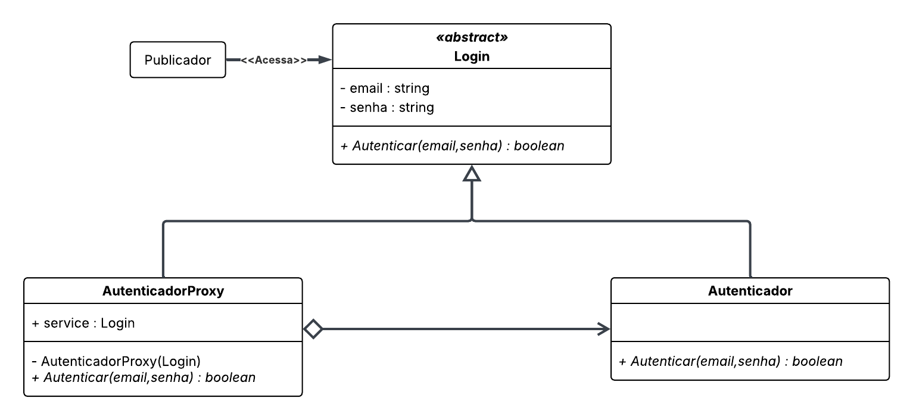

# 3.2.4 Proxy

## 1. Visão Geral

O **Proxy** é um padrão de projeto estrutural que tem como objetivo fornecer um **substituto** ou **representante** para outro objeto. Esse objeto intermediário controla o acesso ao objeto real, permitindo que ações adicionais sejam executadas **antes** ou **depois** da solicitação chegar ao serviço original **([GAMMA et al., 1995](https://www.javier8a.com/itc/bd1/articulo.pdf))**.

Esse padrão é especialmente útil quando o objeto real é pesado, difícil de instanciar, remoto ou sensível em termos de segurança. O Proxy oferece uma camada extra de controle sem exigir modificações no objeto original, o que é ideal quando o código-fonte pertence a bibliotecas externas ou não pode ser alterado ([REFACTORING.GURU, 2026](https://refactoring.guru/design-patterns/proxy)).

<p align="center"><strong>Figura 1: Representação do Proxy</strong></p>


<p align="center"><em>Fonte: <a href="https://refactoring.guru/design-patterns/proxy">Refactoring Guru - Proxy</a></em></p>
</em></p>

## 2. Participantes

| Aluno  | Participação|
| -- | -- |
|  Arthur Guilherme Aquino Santos | Elaboração do **diagrama** e dos **códigos**  |
|  Tiago Lemes Teixeira | Criação da **documentação** e elaboração do **diagrama** e dos **códigos** |
|  Vilmar José Fagundes | Elaboração do **diagrama** e dos **códigos**  |

## 3. Aplicabilidade

O padrão **Proxy** pode ser utilizado em várias situações, sendo algumas das mais comuns ([REFACTORING.GURU, 2026](https://refactoring.guru/design-patterns/proxy)):

## 3.1. Inicialização Preguiçosa (Proxy Virtual)
Usado quando o objeto real é pesado e consome muitos recursos.  
Em vez de criar o objeto ao iniciar a aplicação, o Proxy o instancia **somente quando realmente necessário**, evitando uso desnecessário de recursos.

## 3.2. Controle de Acesso (Proxy de Proteção)
Aplicável quando apenas determinados clientes devem ter acesso ao objeto de serviço.  
O Proxy verifica credenciais e **bloqueia ou autoriza** o acesso.

## 3.3. Execução Local de um Serviço Remoto (Proxy Remoto)
Utilizado quando o objeto real está em outro servidor.  
O Proxy lida com **comunicação remota**, serialização, rede e latência, apresentando ao cliente uma interface local.

## 3.4. Registro de Pedidos (Proxy de Registro)
Útil quando é necessário manter um **histórico de chamadas**.  
O Proxy registra cada requisição antes de repassá-la ao serviço real.

## 3.5. Cache de Resultados (Proxy de Cache)
Aplicado quando muitas requisições retornam sempre os mesmos resultados.  
O Proxy armazena respostas já obtidas e **evita chamadas repetidas** ao objeto real, economizando tempo e recursos.

## 3.6. Referência Inteligente
Indicado quando o objeto real deve ser descartado assim que não houver mais clientes utilizando-o.  
O Proxy monitora o uso do serviço e pode **liberar recursos automaticamente** quando apropriado.

## 4. Prós

- Permite controlar o acesso ao objeto real sem que os clientes percebam.  
- Facilita o gerenciamento do ciclo de vida do objeto de serviço.  
- Funciona mesmo quando o objeto real ainda não está pronto ou disponível.  
- Segue o princípio **Aberto/Fechado**, permitindo introduzir novos tipos de Proxy sem alterar clientes ou serviços.  

## 5. Contras

- Pode aumentar a complexidade da aplicação, já que exige a criação de novas classes.  
- Pode gerar atrasos na resposta, especialmente em proxys que envolvem rede ou processamento adicional.

## 6. Implementação

### 6.1. Senso Crítico

No contexto do **FCTE Hoje**, a aplicação do padrão GoF Proxy mostrou-se particularmente adequada ao desenvolver o sistema de autenticação do Publicador. O objetivo central foi garantir que o Publicador só pudesse realizar ações sensíveis, como publicar ou editar conteúdos, após a validação de suas credenciais por meio do processo de Login. Esse controle é essencial para manter a integridade e a confiabilidade da plataforma, garantindo que apenas usuários autorizados possam manipular informações destinadas ao público.

Durante a atividade, modelou-se a estrutura composta pelas classes `Login`, `Autenticador` e `AutenticadorProxy`, evidenciando como o proxy atua como intermediário entre o usuário e o serviço real de autenticação. O `AutenticadorProxy` foi responsável por verificar as credenciais antes de permitir o acesso ao `Autenticador`, que contém a lógica principal de validação. Essa abordagem assegura que qualquer tentativa de login passe obrigatoriamente pelo controle adicional previsto no proxy.

A construção do padrão ocorreu de forma colaborativa durante a aula de **Dinâmica de Elaboração**, com momentos de discussão conjunta, revisão do diagrama e apresentação do material à professora, visando verificar se estava corretamente representado. Posteriormente, o grupo concentrou-se na implementação das funcionalidades do `Autenticador`, da classe `Login` e das restrições aplicadas no `AutenticadorProxy`.

### 6.2. Diagrama

<p align="center"><strong>Figura 2: Diagrama do Proxy</strong></p>



<p align="center"><em>Autores: <a href="https://github.com/ArthurGuilher62">Arthur Guilherme</a>, <a href="https://github.com/TiagoTeixeira-2005">Tiago Lemes</a> e <a href="https://github.com/VilmarFagundes">Vilmar Fagundes</a></em></p>

### 6.3 Código

#### 6.3.1 Subject

```python
from abc import ABC, abstractmethod

class Login(ABC):
    def __init__(self, email: str, senha: str):
        self._email = email
        self._senha = senha

    @abstractmethod
    def Autenticar(self, email: str, senha: str) -> bool:
        pass
```

#### 6.3.2 Real Subject

```python
class Autenticador(Login):
    def __init__(self, email: str = "", senha: str = ""):
        super().__init__(email, senha)

    def Autenticar(self, email: str, senha: str) -> bool:
        return email == "admin@unb.br" and senha == "123456"
```

#### 6.3.3 Proxy

```python
class AutenticadorProxy(Login):
    def __init__(self, service: Login):
        super().__init__("", "")
        self.service = service  

    def Autenticar(self, email: str, senha: str) -> bool:
        if not email or not senha:
            print("Falha: email ou senha não podem ser vazios.")
            return False

        if "@" not in email:
            print("Falha: email inválido.")
            return False

        print("Proxy: validações realizadas. Encaminhando ao serviço real...")
        
        return self.service.Autenticar(email, senha)
```

### 6.4 Vídeo de Apresentação

## 7. Referências Bibliográficas

> GAMMA, E.; HELM, R.; JOHNSON, R.; VLISSIDES, J. **Design Patterns: Elements of Reusable Object-Oriented Software**. Reading, MA: Addison-Wesley, 1995. Disponível em: [https://www.javier8a.com/itc/bd1/articulo.pdf](https://www.javier8a.com/itc/bd1/articulo.pdf). Acesso em: 15 mai. 2026.
>
>REFACTORING.GURU. **Proxy — Design Patterns**. 2026. Disponível em: [https://refactoring.guru/design-patterns/proxy](https://refactoring.guru/design-patterns/proxy). Acesso em: 16 mai. 2026.

## 8. Histórico de Versões


| Versão | Data | Descrição | Autor(es) | Revisor(es) | Data da revisão |
|--------|------|-----------|-----------|-------------|-----------------|
| `1.0` | 12/05/2026 | Criação do documento. | [Tiago Lemes](https://github.com/TiagoTeixeira-2005) |  |  |
| `1.1` | 16/05/2026 | Documentação da Visão Geral, Aplicabilidade, Prós e Contras. | [Tiago Lemes](https://github.com/TiagoTeixeira-2005) |  |  |
| `1.2` | 18/05/2026 | Adição da documentação do Diagrama. | [Tiago Lemes](https://github.com/TiagoTeixeira-2005) |  |  |
| `1.3` | 19/05/2026 | Adição da documentação do Código. | [Tiago Lemes](https://github.com/TiagoTeixeira-2005) |  |  |
