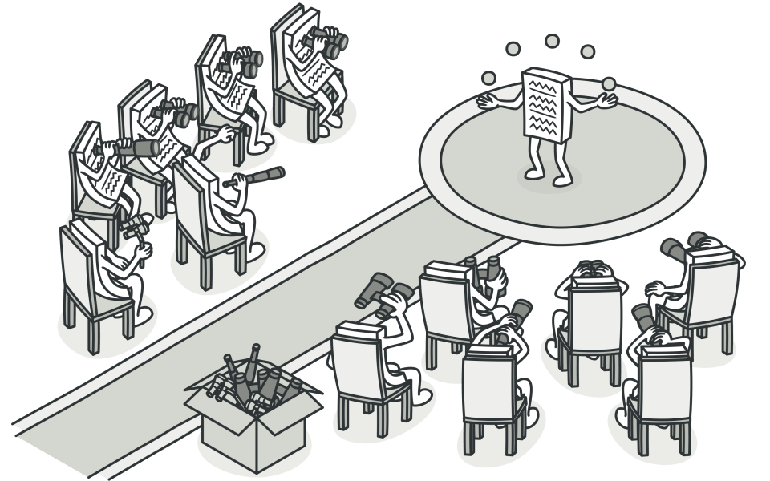
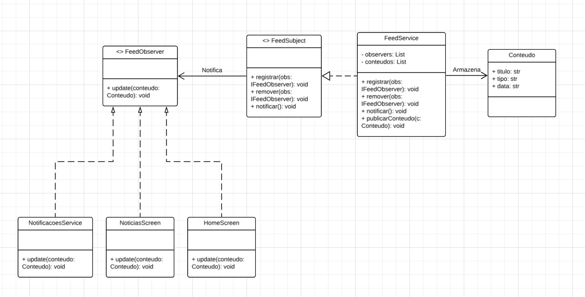

# 3.3.2 Observer

## 1. Visão Geral

O **Observer** é um padrão de projeto **comportamental**, catalogado pela **Gang of Four (GoF)**, que define um mecanismo de assinatura para notificar múltiplos objetos sobre quaisquer eventos que ocorram com o objeto observado. O padrão estabelece uma relação de dependência de um para muitos entre objetos, de modo que, quando um objeto muda de estado, todos os seus dependentes são notificados e atualizados automaticamente **([GAMMA et al., 1995](https://www.javier8a.com/itc/bd1/articulo.pdf))**.

O objeto observado — chamado **Subject** — mantém uma lista de observadores e os notifica através de uma interface comum. Isso promove o desacoplamento entre o produtor de eventos e seus consumidores, permitindo adicionar e remover observadores sem modificar o Subject ([REFACTORING.GURU, 2026](https://refactoring.guru/pt-br/design-patterns/observer)).

<p align="center"><strong>Figura 1: Representação do Observer (Refactoring Guru)</strong></p>



<p align="center"><em>Imagem de referência extraída do site <a href="https://refactoring.guru/pt-br/design-patterns/observer">Refactoring Guru — Observer</a></em></p>

## 2. Participantes

| Aluno  | Participação|
| -- | -- |
| [Felipe Pedroza](https://github.com/darkymeubem) | Elaboração do **diagrama** e do **documento** |
| [Felipe Matheus](https://github.com/femathrl0) | Elaboração do **diagrama** |
| [Felipe Guimarães](https://github.com/felipegf1) | Elaboração do **diagrama** |

## 3. Aplicabilidade

O padrão **Observer** pode ser utilizado em várias situações, sendo algumas das mais comuns ([REFACTORING.GURU, 2026](https://refactoring.guru/pt-br/design-patterns/observer)):

### 3.1. Quando mudanças no estado de um objeto podem exigir mudanças em outros objetos, e o conjunto real de objetos é desconhecido antecipadamente ou muda dinamicamente

O Observer permite que qualquer objeto que implemente a interface de subscriber possa se inscrever para receber notificações de eventos no objeto publicador. Não é necessário modificar o publicador ao adicionar novas classes subscriber.

### 3.2. Quando alguns objetos em sua aplicação devem observar outros, mas apenas por um tempo limitado ou em casos específicos

A lista de inscrição é dinâmica: objetos podem se registrar e cancelar o registro a qualquer momento em tempo de execução, usando os métodos `registrar` e `remover`.

### 3.3. Quando um objeto precisa notificar outros sem fazer suposições sobre quem são esses objetos

O Subject conhece apenas que os observers implementam a interface `update()`. Isso permite que diferentes tipos de observers (telas, serviços, notificações) coexistam sem acoplamento direto com o Subject.

## 4. Prós

- Segue o **Princípio Aberto/Fechado**: novos tipos de subscribers podem ser introduzidos sem alterar o código do publisher.
- Estabelece relações entre objetos em tempo de execução, promovendo flexibilidade.
- Reduz o acoplamento entre o Subject e seus Observers, já que a comunicação ocorre por meio de uma interface comum.

## 5. Contras

- Os subscribers são notificados em ordem aleatória, o que pode ser problemático quando a ordem importa.
- Se não gerenciado corretamente, pode causar **memory leaks**: subscribers que não se desregistram continuam referenciados pelo Subject.
- Cadeias longas de notificações podem tornar o fluxo de execução difícil de rastrear e depurar.

## 6. Implementação

### 6.1. Senso Crítico

No contexto do **FCTE Hoje**, o padrão Observer foi aplicado ao **feed de conteúdo** da plataforma. O `FeedService` atua como Subject concreto: ao receber uma nova publicação via `publicarConteudo()`, ele armazena o conteúdo e notifica automaticamente todos os observers registrados.

Os observers concretos representam diferentes pontos de consumo do conteúdo na aplicação: a `HomeScreen` exibe o item no feed principal, a `NoticiasScreen` lista a notícia na tela de notícias, e o `NotificacoesService` dispara a notificação push para o leitor. Cada um implementa o método `update()` de forma independente, sem conhecer os demais.

Essa escolha complementa os outros padrões do projeto: o **Factory** ([3.1.2](3.1.2.Factory.md)) cria os objetos `Conteudo` com tipo e dados específicos, e o **Proxy** ([3.2.4](3.2.4.Proxy.md)) garante que apenas publicadores autenticados possam inserir conteúdo no feed. O Observer atua estritamente na camada de **distribuição da notificação**, sem se sobrepor à criação ou ao controle de acesso.

### 6.2. Diagrama do projeto

<p align="center"><strong>Figura 2: Diagrama do Observer FCTE Hoje</strong></p>

O diagrama abaixo representa a estrutura do padrão Observer aplicada ao **feed de conteúdo**.



<p align="center"><em>Autor: <a href="https://github.com/darkymeubem">Felipe Pedroza</a>, <a href="https://github.com/femathrl0">Felipe Matheus</a> e <a href="https://github.com/felipegf1">Felipe Guimarães</a></em></p>

### 6.3. Código

#### 6.3.1 Classe de Dados (Conteudo)

```python
class Conteudo:
    def __init__(self, titulo: str, tipo: str, data: str):
        self.titulo = titulo
        self.tipo = tipo
        self.data = data

    def __str__(self):
        return f"[{self.tipo}] {self.titulo} | Data: {self.data}"
```

#### 6.2.2 Subject Concreto (FeedService)

```python
class FeedService:
    def __init__(self):
        self._observers = []
        self._conteudos = []

    def registrar(self, observer) -> None:
        self._observers.append(observer)

    def remover(self, observer) -> None:
        self._observers.remove(observer)

    def notificar(self, conteudo: Conteudo) -> None:
        for observer in self._observers:
            observer.update(conteudo)

    def publicarConteudo(self, conteudo: Conteudo) -> None:
        self._conteudos.append(conteudo)
        self.notificar(conteudo)
```

#### 6.2.3 Observers Concretos

```python
class HomeScreen:
    def update(self, conteudo: Conteudo) -> None:
        print(f"[HomeScreen] Feed atualizado com novo conteudo: {conteudo}")


class NoticiasScreen:
    def update(self, conteudo: Conteudo) -> None:
        print(f"[NoticiasScreen] Nova noticia listada: {conteudo}")


class NotificacoesService:
    def update(self, conteudo: Conteudo) -> None:
        print(f"[NotificacoesService] Notificacao enviada ao leitor: '{conteudo.titulo}'")
```

#### 6.2.4 Exemplo de Uso

```python
# Instancia o Subject
feed = FeedService()

# Instancia os Observers
home = HomeScreen()
noticias = NoticiasScreen()
notificacoes = NotificacoesService()

# Registra os Observers no Subject
feed.registrar(home)
feed.registrar(noticias)
feed.registrar(notificacoes)

# Publica conteudos — todos os observers sao notificados automaticamente
feed.publicarConteudo(Conteudo(
    titulo="Processo seletivo aberto na Orcestra",
    tipo="Oportunidade",
    data="2026-05-20"
))

feed.publicarConteudo(Conteudo(
    titulo="Semana de Computacao da FCTE 2025",
    tipo="Evento",
    data="2026-06-13"
))

# Remove um observer e publica novamente
feed.remover(notificacoes)

feed.publicarConteudo(Conteudo(
    titulo="Cardapio do RU — Quinta-feira",
    tipo="Cardapio",
    data="2026-05-20"
))
```

#### Saída Esperada

```
[HomeScreen] Feed atualizado com novo conteudo: [Oportunidade] Processo seletivo aberto na Orcestra | Data: 2026-05-20
[NoticiasScreen] Nova noticia listada: [Oportunidade] Processo seletivo aberto na Orcestra | Data: 2026-05-20
[NotificacoesService] Notificacao enviada ao leitor: 'Processo seletivo aberto na Orcestra'

[HomeScreen] Feed atualizado com novo conteudo: [Evento] Semana de Computacao da FCTE 2025 | Data: 2026-06-13
[NoticiasScreen] Nova noticia listada: [Evento] Semana de Computacao da FCTE 2025 | Data: 2026-06-13
[NotificacoesService] Notificacao enviada ao leitor: 'Semana de Computacao da FCTE 2025'

[HomeScreen] Feed atualizado com novo conteudo: [Cardapio] Cardapio do RU — Quinta-feira | Data: 2026-05-20
[NoticiasScreen] Nova noticia listada: [Cardapio] Cardapio do RU — Quinta-feira | Data: 2026-05-20
```

## 7. Referências Bibliográficas

> GAMMA, E.; HELM, R.; JOHNSON, R.; VLISSIDES, J. **Design Patterns: Elements of Reusable Object-Oriented Software**. Reading, MA: Addison-Wesley, 1995. Disponível em: [https://www.javier8a.com/itc/bd1/articulo.pdf](https://www.javier8a.com/itc/bd1/articulo.pdf). Acesso em: 21 mai. 2026.
>
> REFACTORING.GURU. **Observer — Padrões de Projeto**. 2026. Disponível em: [https://refactoring.guru/pt-br/design-patterns/observer](https://refactoring.guru/pt-br/design-patterns/observer). Acesso em: 21 mai. 2026.

## 8. Histórico de Versões

| Versão | Data | Descrição | Autor(es) | Revisor(es) | Data da revisão | Detalhes da Revisão |
|--------|------|-----------|-----------|-------------|-----------------|---------------------|
| `1.0` | 12/05/2026 | Criação do documento. | [Tiago Lemes](https://github.com/TiagoTeixeira-2005) |  |  | |
| `1.1` | 21/05/2026 | Adição do conteúdo do documento, implementação Python, diagrama e imagens de referência. | [Felipe Pedroza](https://github.com/darkymeubem), [Felipe Matheus](https://github.com/femathrl0), [Felipe Guimarães](https://github.com/felipegf1) |  |  | |
