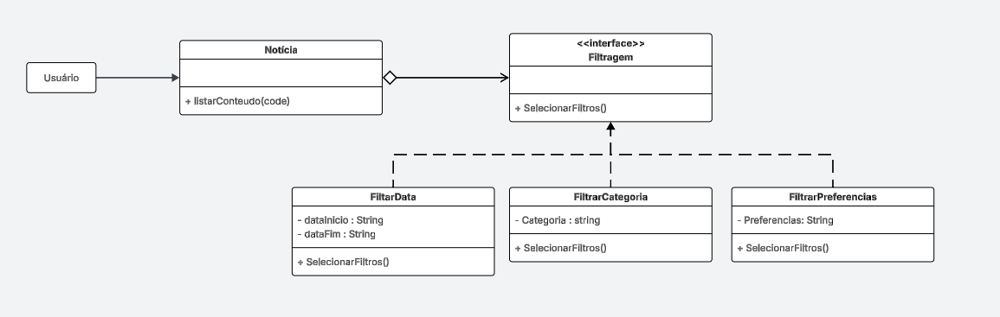

# 3.3.3 Strategy

## 1. Visão Geral

O **Strategy** é um padrão de projeto comportamental que permite definir uma **família de algoritmos**, encapsulá-los em classes separadas e torná-los **intercambiáveis**.  
O objeto que utiliza o algoritmo (chamado *contexto*) não precisa conhecer sua implementação interna, ele apenas delega o trabalho para a estratégia configurada **([GAMMA et al., 1995](https://www.javier8a.com/itc/bd1/articulo.pdf))**.

Esse padrão é especialmente útil quando uma classe precisa executar **variações de um mesmo comportamento** e essas variações mudam com frequência, inchando o código com condicionais ou tornando-o difícil de manter ([REFACTORING.GURU, 2026](https://refactoring.guru/design-patterns/strategy)).

<p align="center"><strong>Figura 1: Representação do Strategy</strong></p>


<p align="center"><em>Fonte: <a href="https://refactoring.guru/design-patterns/strategy">Refactoring Guru - Strategy</a></em></p>
</em></p>

## 2. Participantes

| Aluno  | Participação|
| -- | -- |
|  Arthur Guilherme Aquino Santos |   |
|  Tiago Lemes Teixeira | Criação da Documentação |
|  Vilmar José Fagundes |   |

## 3. Aplicabilidade

O padrão Proxy pode ser utilizado em várias situações, sendo algumas das mais comuns ([REFACTORING.GURU, 2026](https://refactoring.guru/design-patterns/strategy)):

## 3.1. Quando é necessário alternar entre diferentes algoritmos em tempo de execução
Permite mudar dinamicamente a lógica interna de um objeto apenas trocando a estratégia associada.

## 3.2. Quando muitas classes similares variam apenas pelo comportamento
O Strategy permite extrair comportamentos variantes para classes separadas, reduzindo duplicação e deixando o código mais limpo.

## 3.3. Quando se deseja isolar regras de negócio de algoritmos complexos
Ajuda a manter o código organizado separando **como** algo é feito de **o quê** deve ser feito.

## 3.4. Quando existe um grande bloco condicional que alterna entre versões do mesmo algoritmo
O Strategy substitui condicionais extensos (`if`, `switch`) por polimorfismo, reduzindo complexidade e facilitando manutenção.

## 4. Prós

- Permite alternar algoritmos em tempo de execução.  
- Isola detalhes internos de cada algoritmo, deixando o contexto mais limpo.  
- Substitui herança por composição, aumentando flexibilidade.  
- Segue o **Princípio Aberto/Fechado**, permitindo adicionar novas estratégias sem modificar código existente.  

## 5. Contras

- Pode aumentar o número de classes e interfaces no projeto.  
- Os clientes precisam conhecer as diferenças entre estratégias para escolher a adequada.  
- Em linguagens que suportam funções anônimas, usar Strategy pode ser desnecessário, pois o mesmo efeito pode ser obtido com funções sem criar classes adicionais.  

## 6. Implementação

### 6.1. Senso Crítico

No contexto do **FCTE Hoje**, a aplicação do padrão GoF Strategy mostrou-se particularmente adequada ao desenvolver o sistema de filtragem de conteúdos. O objetivo central foi garantir que a listagem possa realizar diferentes estratégias de filtragem, como filtrar por data, categoria ou preferências de conteúdos. Essa flexibilidade é essencial para que, caso haja a necessidade de alteração, adição ou remoção de uma nova estratégia de filtragem, não seja necessária nenhuma mudança no contexto ou nas demais estratégias existentes.

Durante a atividade, modelou-se a estrutura composta pelas classes `Notícia`, `FiltrarData`, `FiltrarCategoria` e `FiltrarPreferencias`, evidenciando como o padrão Strategy permite ao usuário escolher dinamicamente o algoritmo de filtragem de conteúdo. A interface `Filtragem` foi responsável por definir a conexão, delegando as estratégias, permitindo que o contexto execute a filtragem selecionada.

A construção do padrão ocorreu de forma colaborativa durante a aula de **Dinâmica de Elaboração**, com momentos de discussão conjunta, revisão do diagrama e apresentação do material à professora, visando verificar se estava corretamente representado. Posteriormente, o grupo concentrou-se na implementação das funcionalidades da interface `Filtragem` e das classes concretas `FiltrarData`, `FiltrarCategoria` e `FiltrarPreferencias`.

### 6.2 Diagrama

<p align="center"><strong>Figura 2: Diagrama do Strategy</strong></p>



<p align="center"><em>Autores: <a href="https://github.com/ArthurGuilher62">Arthur Guilherme</a>, <a href="https://github.com/TiagoTeixeira-2005">Tiago Lemes</a> e <a href="https://github.com/VilmarFagundes">Vilmar Fagundes</a></em></p>

### 6.3 Código

#### 6.3.1 Contexto e Interface Strategy

```python
from abc import ABC, abstractmethod
from typing import List


class Filtragem(ABC):
    
    @abstractmethod
    def selecionar_filtros(self) -> None:
        """Este método deve ser implementado pelas estratégias reais."""
        pass

class Noticia:
    def __init__(self, estrategia_filtragem: Filtragem):

        self.estrategia_filtragem = estrategia_filtragem
        self.conteudo: List[str] = []

    def listar_conteudo(self, code: str) -> None:
        print(f"Listando conteúdo com o código: {code}")

        self.estrategia_filtragem.selecionar_filtros()
```

#### 6.3.2 Concrete Strategies

```python
class FiltrarData(Filtragem):
    def __init__(self, data_inicio: str, data_fim: str):
        self.data_inicio = data_inicio
        self.data_fim = data_fim

    def selecionar_filtros(self) -> None:
        print(f"Aplicando filtro por Data: de {self.data_inicio} até {self.data_fim}")

class FiltrarCategoria(Filtragem):
    def __init__(self, categoria: str):
        self.categoria = categoria

    def selecionar_filtros(self) -> None:
        print(f"Aplicando filtro pela Categoria: {self.categoria}")

class FiltrarPreferencias(Filtragem):
    def __init__(self, preferencias: str):
        self.preferencias = preferencias

    def selecionar_filtros(self) -> None:
        print(f"Aplicando filtro por Preferências: {self.preferencias}")
```


## 7. Referências Bibliográficas

> GAMMA, E.; HELM, R.; JOHNSON, R.; VLISSIDES, J. **Design Patterns: Elements of Reusable Object-Oriented Software**. Reading, MA: Addison-Wesley, 1995. Disponível em: [https://www.javier8a.com/itc/bd1/articulo.pdf](https://www.javier8a.com/itc/bd1/articulo.pdf). Acesso em: 15 mai. 2026.
>
>REFACTORING.GURU. **Proxy — Design Patterns**. 2026. Disponível em: [https://refactoring.guru/design-patterns/strategy](https://refactoring.guru/design-patterns/strategy). Acesso em: 16 mai. 2026.

## 8. Histórico de Versões


| Versão | Data | Descrição | Autor(es) | Revisor(es) | Data da revisão |
|--------|------|-----------|-----------|-------------|-----------------|
| `1.0` | 12/05/2026 | Criação do documento. | [Tiago Lemes](https://github.com/TiagoTeixeira-2005) | [Arthur GUilherme](https://github.com/ArthurGuilher62) | 19/05/2026 |
| `1.1` | 16/05/2026 | Documentação da Visão Geral, Aplicabilidade, Prós e Contras. | [Tiago Lemes](https://github.com/TiagoTeixeira-2005) | [Arthur GUilherme](https://github.com/ArthurGuilher62) | 19/05/2026 |
| `1.2` | 16/05/2026 | Documentação do Senso Crítico, diagrama do strategy. | [Arthur GUilherme](https://github.com/ArthurGuilher62) |  [Tiago Lemes](https://github.com/TiagoTeixeira-2005) |  20/05/2026 | Revisado e aprovado|
| `1.3` | 20/05/2026 | Documentação do código do strategy. | [Arthur GUilherme](https://github.com/ArthurGuilher62) |  |  |