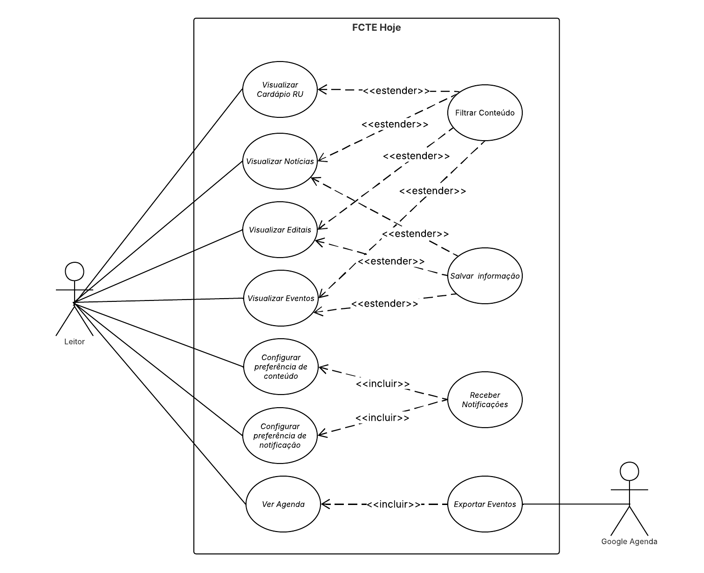
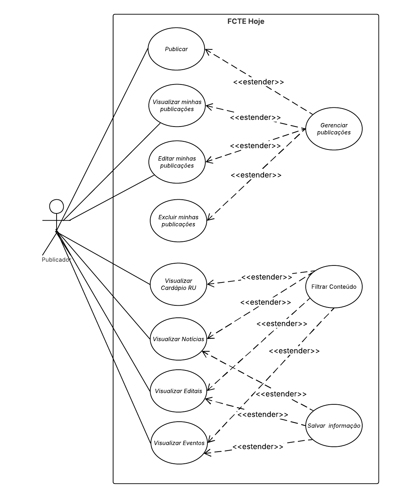

# 3.5.3 Diagramas de Casos de Uso Corrigidos

## 1. Introdução 

Os casos de uso são uma técnica de descoberta de requisitos introduzida inicialmente no método Objectory (JACOBSON et al., 1993). Eles já se tornaram uma característica fundamental da linguagem de modelagem unificada (UML — do inglês unified modeling language). Em sua forma mais simples, um caso de uso identifica os atores envolvidos em uma interação e dá nome ao tipo de interação. Essa é, então, suplementada por informações adicionais que descrevem a interação com o sistema. A informação adicional pode ser uma descrição textual ou um ou mais modelos gráficos, como diagrama de sequência ou de estados da UML. *(SOMMERVILLE, 2011, p. 74)*

## 2. Participantes

| Aluno  | Participação|
| -- | -- |
|  Arthur Guilherme Aquino Santos |  Participação na correção do diagrama |
|  Tiago Lemes Teixeira | Contribuição na documentação e Participação na correção do diagrama |
|  Vilmar José Fagundes  | Participação na correção do diagrama |

## 3. Objetivo

Com base no parecer realizado pela professora Milene referente à [Entrega 2](https://unbarqdsw2026-1-turma01.github.io/2026.1-T01-_G4_FCTE_Hoje_Entrega_02/#/Modelagem/2.3.1.DiagramaDeCasosDeUso?id=diagrama-de-casos-de-uso), buscamos corrigir os pontos levantados, visando a uma maior precisão e adequação do artefato.

## 4. Metodologia

Para a correção do diagrama, foi utilizada a notação padrão da **UML**, e foi realizada uma reunião durante a aula de **Dinâmica de Elaboração**, na qual os Diagramas de Casos de Uso foram corrigidos, com momentos de discussão conjunta entre os integrantes do artefato e revisão dos [Diagramas de Casos de Uso da etapa anterior](https://unbarqdsw2026-1-turma01.github.io/2026.1-T01-_G4_FCTE_Hoje_Entrega_02/#/Modelagem/2.3.1.DiagramaDeCasosDeUso?id=diagrama-de-casos-de-uso) com base no parecer da professora. A metodologia consistiu nos seguintes passos:

- **Análise das informações adicionais que descrevem a interação com o sistema:** Foram analisadas a lista de requisitos e os diagramas para compreender a funcionalidade do sistema;
- **Identificação dos Atores:** Definir quem ou o que irá interagir com o sistema;
- **Definir as interações:** O que o sistema vai interagir com os Atores;
- **Realizar a modelagem dos relacionamentos:** Utilização dos relacionamentos *incluir*, *extender* e Generalização para representar as dependências e lógicas entre os casos de uso e atores.
- **Análise do ator intitulado "Sistema":** Com base no parecer da professora, verificou-se que não era necessário existir um ator denominado `Sistema`, tendo em vista que não se trata de um sistema terceiro e que o sistema **FCTE Hoje** já é representado dentro da fronteira do sistema.

## Diagrama de Casos de Uso

<strong>Figura 1: Diagrama de Casos de Uso do Leitor</strong>

<em>Autores: <a href="https://github.com/ArthurGuilher62">Arthur Guilherme</a>, <a href="https://github.com/TiagoTeixeira-2005">Tiago Lemes</a> e <a href="https://github.com/VilmarFagundes">Vilmar Fagundes</a></em>

---

<strong>Figura 2: Diagrama de Casos de Uso do Publicador</strong>

<em>Autores: <a href="https://github.com/ArthurGuilher62">Arthur Guilherme</a>, <a href="https://github.com/TiagoTeixeira-2005">Tiago Lemes</a> e <a href="https://github.com/VilmarFagundes">Vilmar Fagundes</a></em>

## Mapeamento de Casos de Uso

| Ator | Casos de Uso |
| -- | -- |
| **Leitor** | UC01 - Visualizar Cardápio RU   UC02 - Visualizar Notícias   UC03 - Visualizar Editais   UC04 - Visualizar Eventos   UC05 - Filtrar Conteúdo   UC06 - Salvar informação   UC07 - Configurar preferência de conteúdo   UC08 - Configurar preferência de notificação   UC09 - Receber Notificações   UC10 - Ver agenda |
| **Publicador** | UC01 - Visualizar Cardápio RU   UC02 - Visualizar Notícias   UC03 - Visualizar Editais   UC04 - Visualizar Eventos   UC05 - Filtrar Conteúdo   UC06 - Salvar informação   UC12 - Publicar   UC13 - Visualizar minhas publicações   UC14 - Editar minhas publicações   UC15 - Excluir minhas publicações   UC16 - Gerenciar publicações |
| **Google Agenda** | UC11 - Exportar eventos |

## Conclusão

A elaboração dos Diagramas de Casos de Uso permitiu consolidar, de forma visual e padronizada pela notação UML, o entendimento das interações previstas no sistema **FCTE Hoje**. A separação em duas perspectivas **Leitor** (Figura 1) e **Publicador** (Figura 2) evidenciou que a aplicação atende a dois perfis de usuário com necessidades distintas: enquanto o Leitor concentra-se no consumo da informação (visualização, busca e acompanhamento de conteúdos), o Publicador atua na produção e gestão dessas informações (criação, edição e moderação de publicações).

Além disso, após as correções realizadas com base no parecer da professora, foi possível aprimorar a clareza das interações e garantir maior alinhamento entre os requisitos do sistema e sua representação em forma de Diagrama de Casos de Uso. 

## Referências 

> SOMMERVILLE, Ian. Engenharia de software. 9. ed. São Paulo: Pearson Prentice Hall, 2011. Disponível em: [SOMMERVILLE, 2011](https://archive.org/details/sommerville-engenharia-de-software-9a/mode/2up?q=diagrama+caso). Acesso em: 14 abr. 2026.

> Lucid Software Português. Tutorial de Caso de Uso UML. Youtube, 25 abr. 2019. Disponível em: [https://youtu.be/ab6eDdwS3rA?si=geKJuyxRkgBXmeJE](https://youtu.be/ab6eDdwS3rA?si=geKJuyxRkgBXmeJE). Acesso em: 14 abr. 2026.

| Versão | Data | Descrição | Autor(es) | Revisor(es) | Data da revisão |
|--------|------|-----------|-----------|-------------|-----------------|
| `1.0` | 18/05/2026 | Criação do documento. | [Tiago Lemes](https://github.com/TiagoTeixeira-2005) |  |  |
